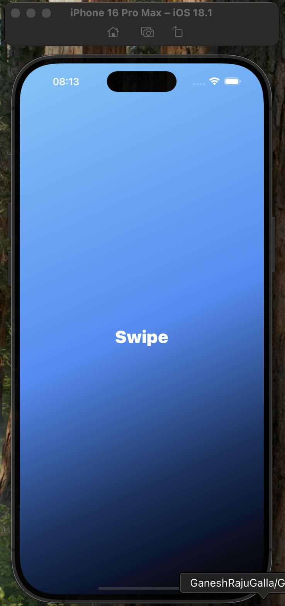
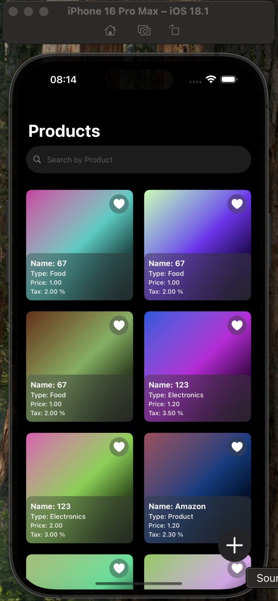
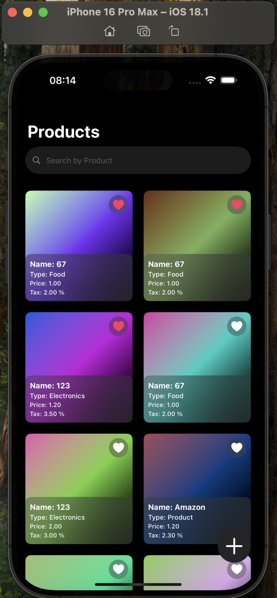
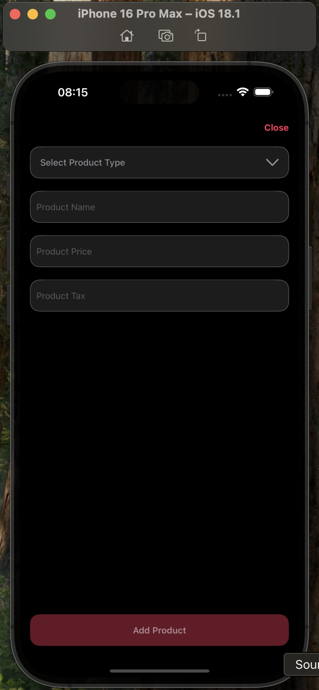

# Swipe

## App SnapShots

| Launch | Products | Favourite | AddProduct |
| -- | -- | -- | -- | 
|  |  |  | 
## Overview

Swipe is a modern iOS application designed to streamline product management with features like product listing, searching, and adding new products. This README provides an in-depth overview of the app's features, functionality, and technical implementation.

---

## Tech Stack

- **Xcode**: 16.1  
- **macOS**: Ventura 13.5.2  
- **iOS**: 18  
- **Swift**: 5.9  
- **SwiftUI**  
- **SwiftData**  

---

## Feature Highlights

### Animated Launch Screen
- Swipe welcomes users with a polished and visually appealing launch animation that enhances the app's professionalism and first impressions.

### Product Listing Screen
- Displays a scrollable list of products fetched from an API, complete with the following details:
  - **Product Name**
  - **Product Type**
  - **Price**
  - **Tax**
  - **Product Image** (with a default image fallback for missing URLs)
- Includes a **search bar** to filter products by name or type.
- Users can mark products as favorites with a heart icon. Favorited products:
  - Appear at the top of the list.
  - Retain their status locally even after restarting the app.
- Smooth scrolling with a visually appealing design ensures a seamless browsing experience.
- **Loading Indicator**: Displays a progress bar while the product data is being fetched.

### Add Product Screen
- Users can add new products using:
  - A **dropdown** to select the product type.
  - **Text fields** to enter the product name, price, and tax rate.
  - An **optional image uploader** for JPEG or PNG images with a 1:1 aspect ratio.
- **Validation**: Ensures required fields are filled and numeric values are valid before submission.

### Offline Functionality
- Products added while offline are stored locally using **SwiftData**.
- Locally saved products are synced with the server automatically when the internet connection is restored.

### Persistence with SwiftData
- Leveraging **SwiftData** for local storage ensures offline functionality and smooth operation without internet dependency.
- Data such as product details and favorites are stored securely and efficiently.
- [Learn more about SwiftData](https://developer.apple.com/xcode/swiftdata/)

---

## Architecture

- **MVVM (Model-View-ViewModel)**:
  - Ensures a clean, maintainable, and scalable codebase by separating the app's data, user interface, and business logic.

- **Async/Await Networking**:
  - Implements a modern async/await-based `URLSession` API client for clean and efficient network requests.
  - Inspired by Moya's design, the API client provides a structured way to handle API interactions.

---

## Getting Started

Follow these steps to get started with Swipe:

1. **Clone the Repository**:
   ```bash
   git clone https://github.com/themacbookaircoder/Swipe.git

2. **Open the Project**:
- Navigate to the project directory and open `Swipe.xcodeproj` in Xcode.

3. **Run the App**:
- Select a target device or simulator running and click the **Run** button in Xcode.

4. **Test Features**:
- Explore the following features:
  - **Product Listing**: View and search through the product list.
  - **Add New Products**: Use the Add Product screen to submit new product details.
  - **Offline Functionality**: Test the offline feature by adding products without internet connectivity.
  - **Favorites**: Mark products as favorites and verify their local persistence.

---

## Demo

To see Swipe in action, watch the demo video: [Demo Video Link](https://drive.google.com/file/d/1pMye-_Dasi_we65zttS-NpILIvn8-qF4/view?usp=sharing).

---

## Support and Contact

If you have any questions or require assistance, please contact:
- **Email**: kuldipaavashist@gmail.com  

---

Enjoy using Swipe to manage your products effortlessly!
